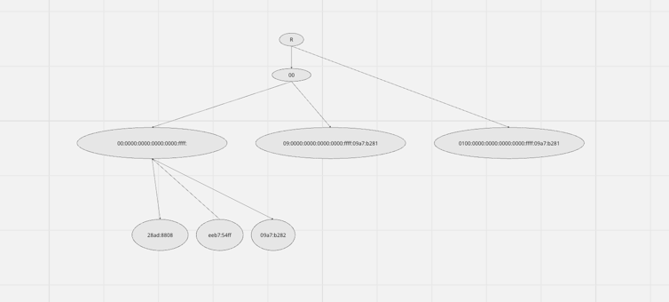

# Radix Tree IP Storage Solution

## Quick Overview
This project tackles the efficient management of IP addresses by implementing a Radix Tree in Go, optimized for both IPv4 and IPv6 addresses. 

## Key Features:
- Dual IP Version Support: Seamlessly handles IPv4/IPv6 addresses, ensuring broad compatibility and utility.
- Efficient and Fast: Leverages the Radix Tree's structure for minimal memory usage and rapid search capabilities.
- Scalable: Designed to perform under growing data volumes, crucial for networking and security applications.

